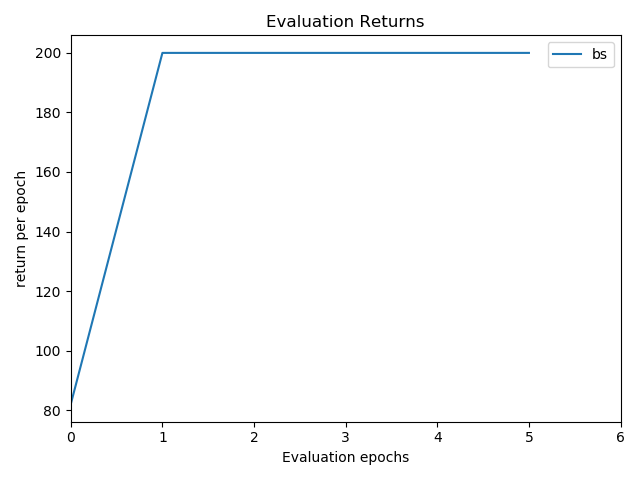
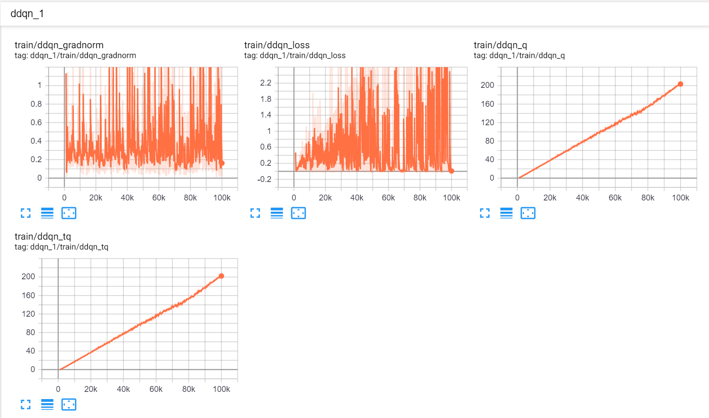

# Double Deep Q-network
This is a modified version of DDQN (Double Deep Q-network) of listed references based on Tensorflow. 

### Prerequisites
- Python 3 or above
- tensorflow 1.14
- gym 0.9.2

### performance
- CartPole-v0

It takes about 10 hours to run 2e7 steps on computer with 2 GPU 2080 Ti, Intel i9-9820X CPU (10 Cores) and 128 GB Memory. The algorithm takes about 4.5 hours to converge.

     
      Fig.1 Training process on CartPole-v0

     
      Fig.2 Evaluation process on CartPole-v0

You can also monitor the training process by type
`tensorboard --logdir=experiments/experiment_breakout/summaries --host localhost --port 8088` (on windows). or `tensorboard --logdir=experiments/experiment_breakout/summaries` (on Linux).

     
      Fig.3 Tensorboard plot of CartPole-v0

### References
[1. OpenAI Baselines](https://github.com/openai/baselines)

[2. cts198859's Implementation](https://github.com/cts198859/deeprl_signal_control)

